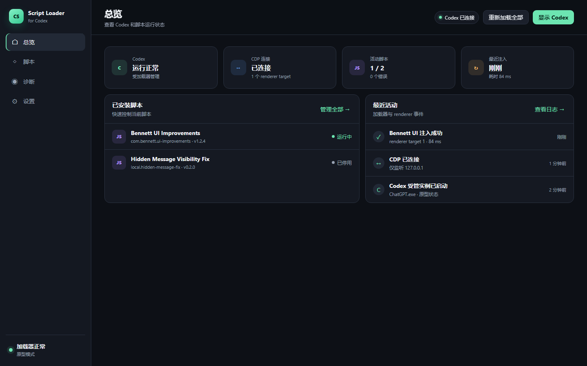

# UI Prototype

这是 Codex Script Loader 桌面管理界面的无依赖交互原型，用于验证信息架构和操作流程。

直接打开 `index.html` 时会进入静态演示模式，不修改本机文件。在仓库根目录运行 `node src/cli.mjs serve --data-dir .runtime/manual` 后，页面会连接 Node 本地管理 API，脚本检查、复制安装、启停配置、可恢复隔离/恢复、安全模式、dry-run 计划和离线诊断均使用真实 loader 数据。

当前管理服务不会打开、检查或附加 Codex，也没有 live injector。真实 Codex 启动/CDP 注入会在用户允许重启并完成单独真机测试后实现；是否增加 Rust/Tauri 桌面壳不影响现有 Node 核心和 API。

